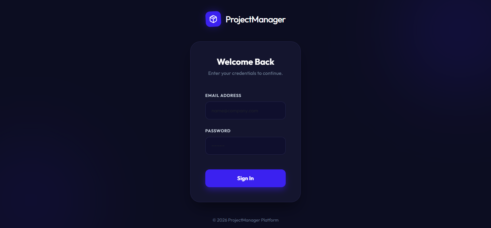
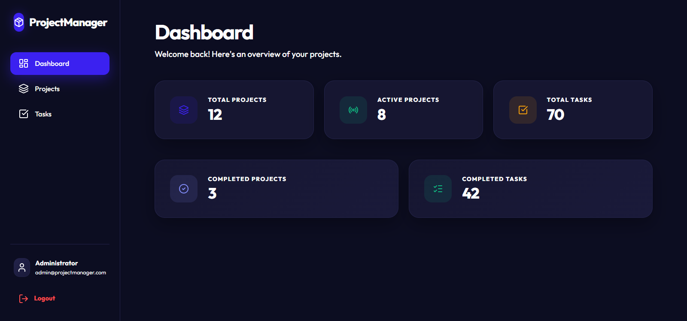
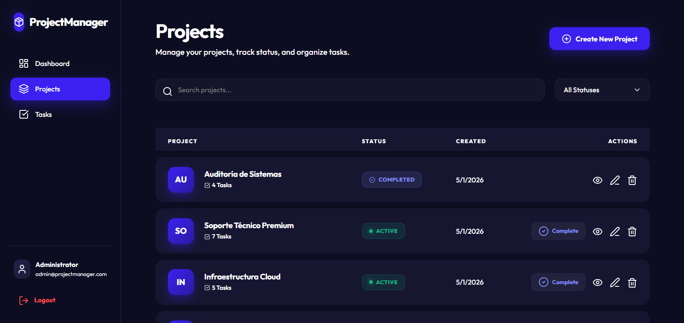
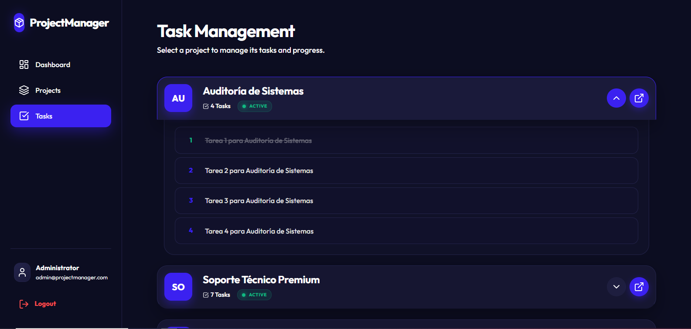
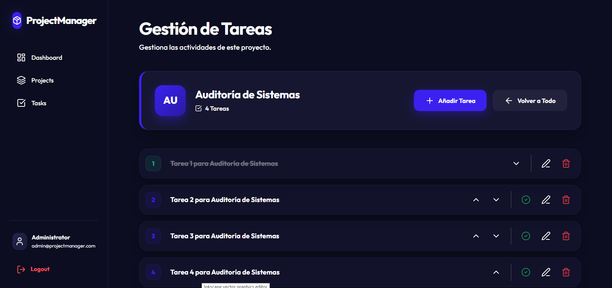

# ProjectManager — Plataforma de Gestión de Proyectos y Tareas

Aplicación monolítica en .NET 8 para la gestión de **Proyectos** y **Tareas**, que incluye:
- Una aplicación web **MVC** para interacción visual
- Una **API REST** que expone las mismas funcionalidades
- Una lógica de negocio centralizada y reutilizable (Clean Architecture)

> La aplicación web **NO** consume la API vía HTTP. Tanto los controladores web como los controladores API consumen los mismos servicios de aplicación directamente.

## Arquitectura

```
ProjectManager.sln
├── src/
│   ├── ProjectManager.Domain/         → Entidades y enums
│   ├── ProjectManager.Application/    → DTOs, interfaces, servicios
│   ├── ProjectManager.Infrastructure/ → EF Core, PostgreSQL, Identity, JWT
│   └── ProjectManager.Web/           → MVC + API (aplicación host)
└── ProjectManager.Tests/             → Tests unitarios (xUnit)
```

## Screenshots

### Login


### Dashboard


### Proyectos


### Manejo de tareas


### Vista detakkada de tareas


## Configuración de la Base de Datos

### Opción 1: Variables de entorno (`.env`)

Crear un archivo `.env` en la raíz del proyecto:

```env
POSTGRES_HOST=localhost
POSTGRES_PORT=5432
POSTGRES_DB=projectmanager
POSTGRES_USER=postgres
POSTGRES_PASSWORD=yourpassword
JWT_KEY=super_secret_key_1234567890123456_project_manager
```

### Opción 2: Docker

```bash
docker-compose up -d
```

## Migrations

Asegúrate de tener instalada la herramienta de Entity Framework:
```bash
dotnet tool install --global dotnet-ef
```

### Comandos de Migración

Ejecuta estos comandos desde la raíz del proyecto:

1. **Crear migración inicial:**
```bash
dotnet ef migrations add InitialMigration --project src/ProjectManager.Infrastructure --startup-project src/ProjectManager.Web --output-dir Persistence/Migrations
```

2. **Aplicar a la base de datos:**
```bash
dotnet ef database update --project src/ProjectManager.Infrastructure --startup-project src/ProjectManager.Web
```

## Cómo Ejecutar la Aplicación

```bash
# Restaurar paquetes
dotnet restore ProjectManager.sln

# Ejecutar la aplicación (MVC + API)
dotnet run --project src/ProjectManager.Web
```

La aplicación estará disponible en:
- **Web MVC**: `http://localhost:5000`
- **Swagger API**: `http://localhost:5000/swagger`

## Credenciales del Usuario de Prueba

| Email | Password |
|---|---|
| `admin@projectmanager.com` | `Admin123!` |

## API Endpoints

### Autenticación (sin seguridad)
| Método | Endpoint | Descripción |
|---|---|---|
| POST | `/api/auth/register` | Registrar usuario |
| POST | `/api/auth/login` | Iniciar sesión (retorna JWT) |

### Proyectos (con seguridad - JWT)
| Método | Endpoint | Descripción |
|---|---|---|
| GET | `/api/projects/search?status=&page=&pageSize=` | Listar proyectos con filtros |
| GET | `/api/projects/{id}/tasks` | Listar tareas de un proyecto |
| POST | `/api/projects` | Crear proyecto |
| PUT | `/api/projects/{id}` | Editar proyecto |
| GET | `/api/projects/{id}/summary` | Resumen del proyecto |
| PATCH | `/api/projects/{id}/activate` | Activar proyecto |
| PATCH | `/api/projects/{id}/complete` | Completar proyecto |

### Tareas (con seguridad - JWT)
| Método | Endpoint | Descripción |
|---|---|---|
| POST | `/api/tasks/{projectId}` | Crear tarea |
| PUT | `/api/tasks/{id}` | Editar tarea |
| DELETE | `/api/tasks/{id}` | Eliminar tarea |
| PATCH | `/api/tasks/{id}/complete` | Marcar tarea como completada |
| PATCH | `/api/tasks/{id}/reorder` | Reordenar tarea |

## Tests

```bash
dotnet test ProjectManager.Tests
```

Tests implementados:
1. `ActivateProject_WithTasks_ShouldSucceed`
2. `ActivateProject_WithoutTasks_ShouldFail`
3. `CompleteProject_WithPendingTasks_ShouldFail`
4. `CreateTask_WithDuplicateOrder_ShouldFail`
5. `DeleteProject_ShouldBeDelete`
6. `CreateTask_WithUniqueOrder_ShouldSucceed`
7. `CompleteTask_ShouldSetIsCompletedTrue`
